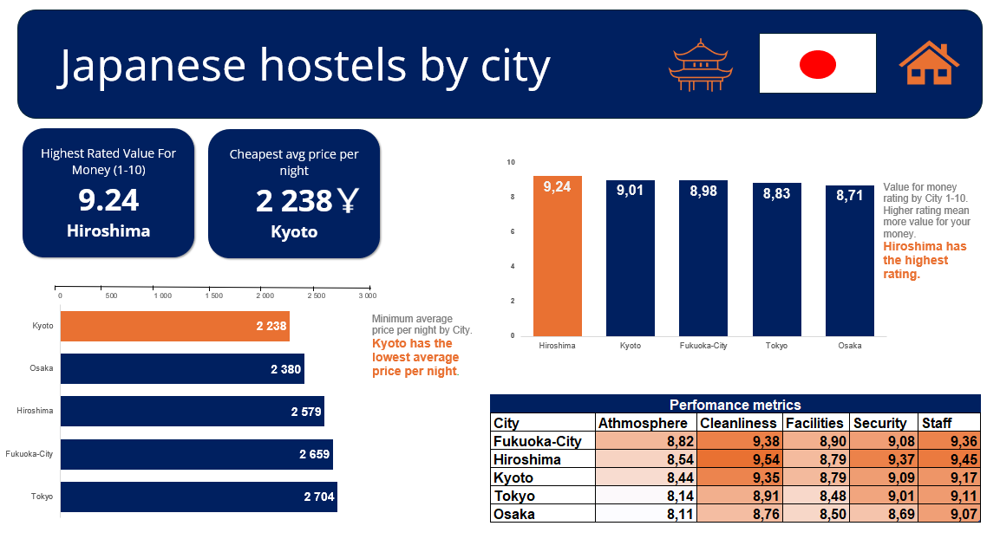

# In this mini project:
- Analyzed data of Japanese Hostels.
* Data gathered from Kaggle then cleaned and formatted using Power Query.
* Unnecessary columns and outliers were managed or removed.
* Used pivot tables to aggregate data.
* Created a dashboard to showcase insights.

**Insights and conclusion**:
- **Price:** If price is the most important metric then Kyoto is recommended.
- **Highest rating:** 
Hiroshima recieves the highest rating, note that the rating is not an average of the metrics shown. 
Hiroshima is recommended if quality and high rating on performance metrics is required and if price is less relevant.

 
